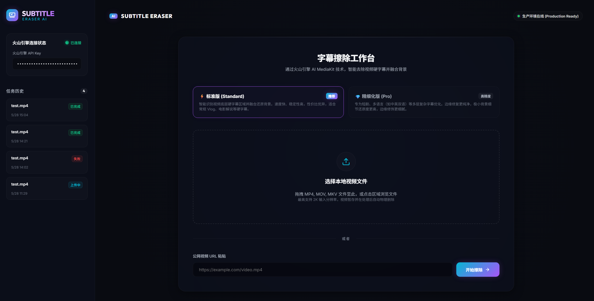
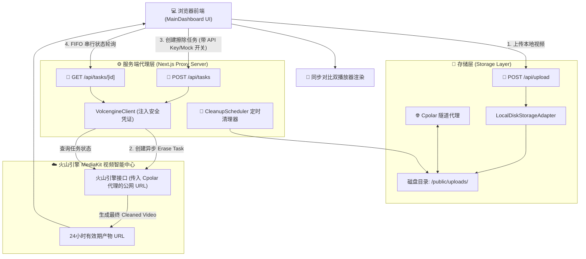

# ✨ Subtitle Eraser (视频硬字幕擦除器)

[](https://nextjs.org)
[](https://reactjs.org)
[](https://www.typescriptlang.org)
[](https://www.volcengine.com/)

**Subtitle Eraser** 是一款专为视频创作者、搬运者及翻译人员打造的高端智能硬字幕擦除 Web 系统。该应用基于 **Next.js 14 (App Router)** 全栈架构，底层深度对接**火山引擎 MediaKit AI 字幕擦除服务**，能够智能检测并消除视频画面中已有的硬字幕（Hard Subtitles），并使用先进的背景画幅修补与融合算法，完美还原无字幕的视频背景。

网页端采用极具视觉冲击力的 **暗黑霓虹磨砂玻璃拟态（Neon Glassmorphism Dark Mode）** 仪表盘设计，给用户带来极致流畅、高档科技感的交互体验。

---

## 📸 界面预览



---

## 🌟 核心特性

### 🌌 极致暗黑科技美学 UI (Neon Glassmorphism)
- 全站采用毛玻璃拟态（Glassmorphism）和精细的霓虹边缘发光（Neon Glow）微交互设计。
- 响应式弹性布局与高级多态过渡动画，提供极致丝滑的页面交互感受。
- 仪表盘侧边栏完美集成任务历史记录和擦除版本选择器。

### ⚡ 双通道 AI 字幕擦除 (Standard & Pro Modes)
- **标准版 (Standard Mode)**：快速高效检测并擦除字幕背景，适用于常规视频。
- **专业版 (Pro Mode)**：采用最前沿的 AI 深度补全（Inpainting）大模型，针对复杂纹理、高动态或光影多变的背景进行像素级背景融合，画质近乎无损还原。

### 🔄 毫秒级双视频同步播放器 (Sync Dual-Player)
- 任务完成后，自动呈现左右对称的 **源视频 (Source Video)** 与 **去字幕产物 (Cleaned Video)** 的对比区域。
- 双播放器底层通过高精度时间戳关联，实现 **同步播放、暂停、进度条拖拽对比**。

### ⚙️ 串行后台轮询引擎与死锁监控 (FIFO Polling Engine)
- **串行轮询调度 (FIFO queue)**：内置高并发队列管理器，每次仅允许 1 个任务占用 API 轮询通道，规避火山引擎 API 的并发限流问题。
- **自适应退避算法 (Adaptive Backoff)**：智能调整状态轮询（Status Polling）频次，任务执行前期高频检测、后期自动降频，兼顾实时性与服务器负载。
- **8分钟死锁自动强退 (Deadlock Safeguard)**：轮询异常挂起或火山端超时时自动拦截，支持用户手动“强制终止（Force Quit）”任务。
- **高可见度里程碑日志 (Milestone Logs)**：实时展示上传、创建、排队、AI擦除到完成的详细阶段与精确耗时。

### 🌐 一键内网穿透与分发分发支持 (Cpolar Tunneling)
- 火山引擎要求必须提供公网可访问的 **Source Video** URL。
- 为此，本项目在 `release_templates/` 下内置了 **Cpolar (极点云) 穿透部署快捷套件**（`start.bat` & `config.env.example`）。
- 启动后自动建立反向隧道，将本地服务映射到公网，后端 API 自动获取公网代理 URL 注册任务，使得火山引擎接口可以直接安全读取到本地上传的视频。

### 🧹 后台空间自清理器 (CleanupScheduler)
- 服务端后台搭载独立的垃圾文件清理进程，默认每隔 15 分钟扫描并物理删除已满 2 小时限制的临时视频文件。
- 在用户确认任务成功/失败的第一时间，也会自动触发清除本地 `Source Video`，确保服务器磁盘永不溢满。

### 🧪 零成本闭环 Mock 模式 (Mock Mode)
- 支持在前端无配置 API Key 的情况下开启 **Mock Mode**。
- 基于正态分布的耗时拟真算法，完美模拟上传、异步排队、擦除状态推进，方便零配置部署演示与纯前端交互测试。

### 🛡️ 客户端安全 Key 绑定 (Client-Safe Credentials)
- 支持用户绑定自己的火山引擎 API 凭证，且凭证仅保存在用户浏览器 `localStorage` 中。
- 发起擦除时临时通过 Next.js 后端代理转发，绝不将凭证暴露至任何第三方服务器。

---

## 🛠️ 技术栈

- **前端核心**：React 18, Next.js 14 (App Router), TypeScript
- **样式方案**：CSS Modules, Vanilla CSS (定制毛玻璃与霓虹滤镜)
- **后端架构**：Next.js Route Handlers (Edge & Node 兼容)
- **视频控制**：双实例 React HTML5 Video Synchronization Engine
- **核心模块设计**：
  - `StorageAdapter` (文件存取抽象接口，本地默认实现为 `LocalDiskStorageAdapter`)
  - `VolcengineClient` (火山引擎 MediaKit API 签名鉴权客户端)
  - `PollingEngine` (串行及自适应轮询逻辑)
  - `CleanupScheduler` (生命周期文件定时清理器)

---

## 📐 核心架构流图



---

## 📖 领域专业词汇表 (CONTEXT)

为了保证开发、文档和演示逻辑中概念的统一性，请严格遵循以下核心词汇契约：

| 推荐术语 (Domain Term) | 英文对应 | 描述 | 避免使用 (Avoid) |
| :--- | :--- | :--- | :--- |
| **字幕擦除任务** | **Erase Task** | 提交到火山引擎 API 进行视频字幕检测并擦除的异步工作流。 | Job, process, 字幕任务 |
| **源视频** | **Source Video** | 包含原始硬字幕的待处理视频（通常通过公网 URL 访问）。 | 输入视频, original video, 视频链接 |
| **已消除字幕的视频** | **Cleaned Video** | 字幕已被 AI 完全融合擦除后的最终产物 MP4 视频。 | 输出视频, 结果视频, clean video |
| **状态轮询** | **Status Polling** | 客户端/代理端周期性地自适应检查任务是否处理完毕的异步过程。 | 轮询, 查询任务, fetching status |
| **模拟模式** | **Mock Mode** | 方便本地脱机展示、开发调试的伪任务生成模式，不消耗火山引擎额度。 | Dry run, sandbox, 假数据模式 |

---

## 🚀 快速上手与本地启动

### 1. 前置准备
- 安装 [Node.js](https://nodejs.org) v18.0.0+ 
- 可选：注册 [火山引擎 MediaKit](https://www.volcengine.com/) 并获取您的 API Key（用于真实擦除功能）
- 可选：注册 [Cpolar (极点云)](https://www.cpolar.com/) 并下载客户端（用于本地调试外网回调）

### 2. 获取代码与依赖安装
```bash
git clone https://github.com/guochaopeng110-maker/EraseVideoSubtitle.git
cd EraseVideoSubtitle
npm install
```

### 3. 环境变量配置
在项目根目录下创建 `.env` (或 `.env.local`) 文件，并根据需要配置：

```env
# 真实火山引擎 API 密钥（全局默认，网页端若配置了个人密钥则优先使用个人密钥）
VOLCENGINE_API_KEY=your_global_volcengine_api_key_here

# 临时视频文件清理周期配置
TEMP_FILE_MAX_AGE_MINS=120
CLEANUP_CRON_INTERVAL_MINS=15

# Cpolar 本地调试内网穿透公网代理地址 (非常重要：解决本地上传火山引擎拉取不到视频的痛点)
# 若配置了此项，API 生成的 Source Video URL 将自动拼接成此公网域名
NEXT_PUBLIC_FORCE_CPOLAR_URL=https://your-cpolar-subdomain.cpolar.io
```

### 4. 运行开发服务器
```bash
npm run dev
```
打开浏览器访问 [http://localhost:3000](http://localhost:3000) 即可使用。您可以立刻在左下角开启 **Mock Mode**，直接拖入本地视频进行全套无感流程体验！

---

## 🌐 本地公网隧道穿透指南 (Cpolar)

火山引擎等三方 AI 服务拉取视频时，若填入 `localhost/127.0.0.1` 链接将无法读取。本项目已附带极速穿透工具模板：

1. 打开项目根目录下的 `release_templates/` 文件夹。
2. 将 `config.env.example` 复制并重命名为 `config.env`，填入您在 Cpolar 官网上申请获取的 `AUTHTOKEN`：
   ```env
   # 在 Cpolar 官网控制台获取的 Auth Token
   CPOLAR_AUTHTOKEN=your_cpolar_authtoken_here
   ```
3. 双击运行 `start.bat`。该脚本会自动在项目根目录下下载、配置并运行 `cpolar` 穿透隧道（默认映射本地 3000 端口）。
4. 运行成功后，控制台将显示类似 `https://xxxxxx.cpolar.top` 的公网地址。
5. 将该公网地址复制填入根目录下的 `.env` 中的 `NEXT_PUBLIC_FORCE_CPOLAR_URL` 字段，随后重启 `npm run dev` 服务，本地即可化身完备的公网开发与线上联动环境！

---

## 🧪 运行测试集
项目配备了完整的 Vitest 行为单元测试套件，用以验证轮询逻辑、生命周期垃圾清理与 API 代理行为：

```bash
# 运行单元测试
npm run test

# 运行覆盖率测试
npm run test:coverage
```

---

## 📄 开源许可证
本项目遵循 [MIT License](LICENSE) 协议。
